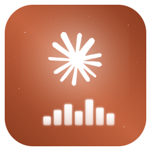
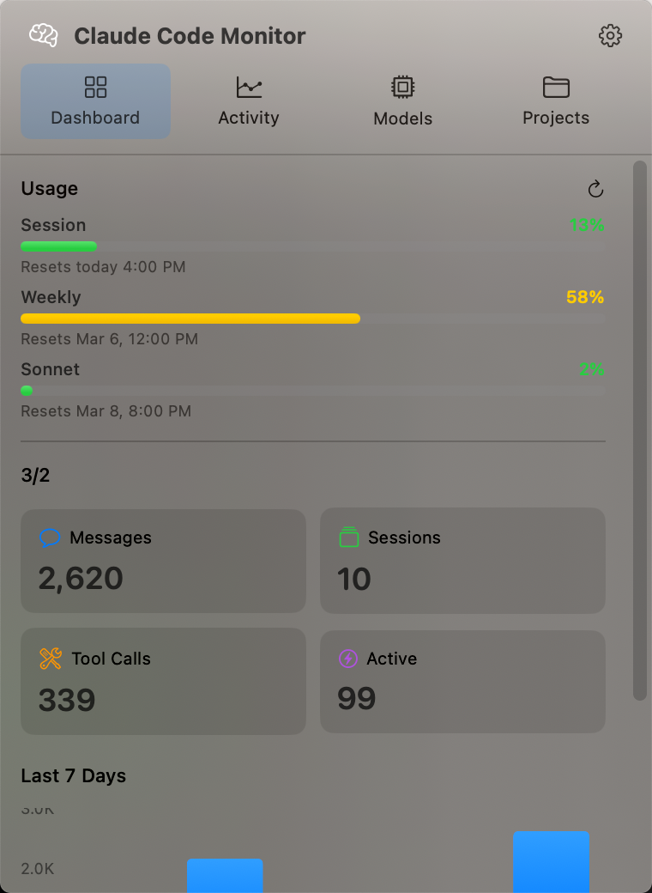
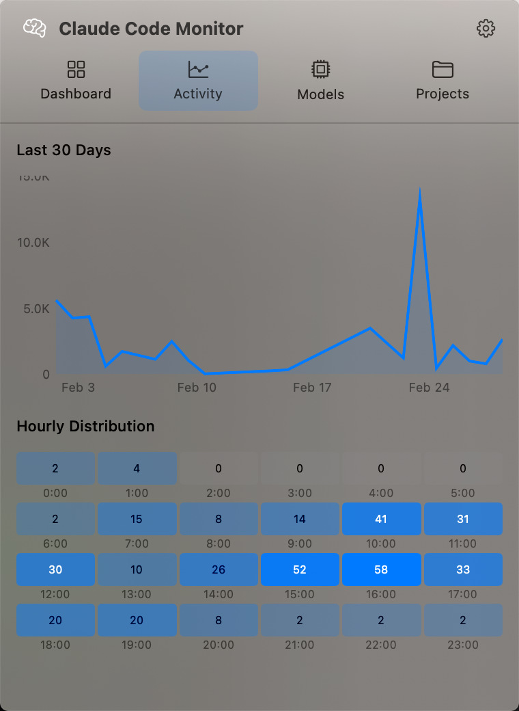
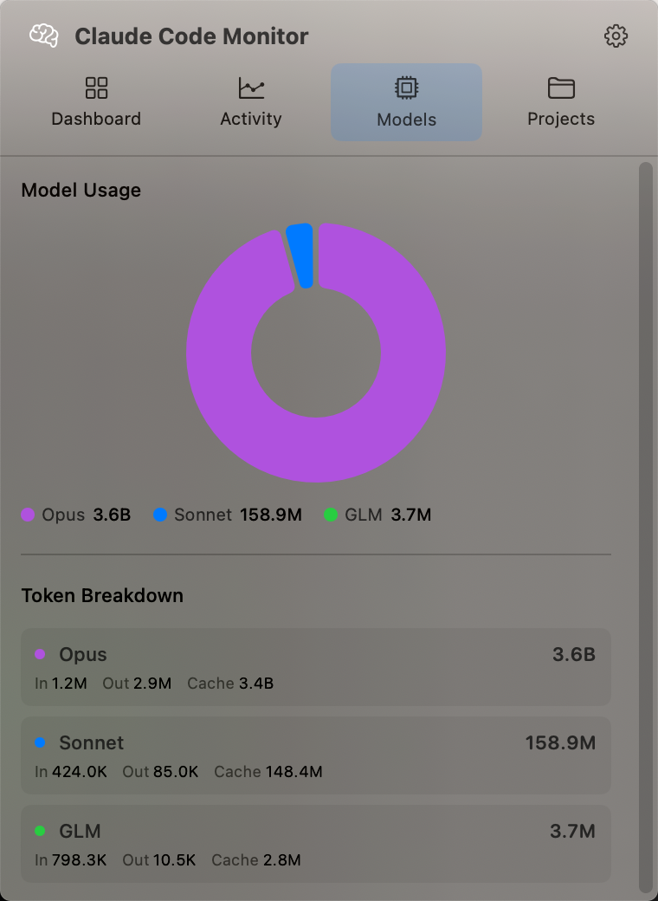
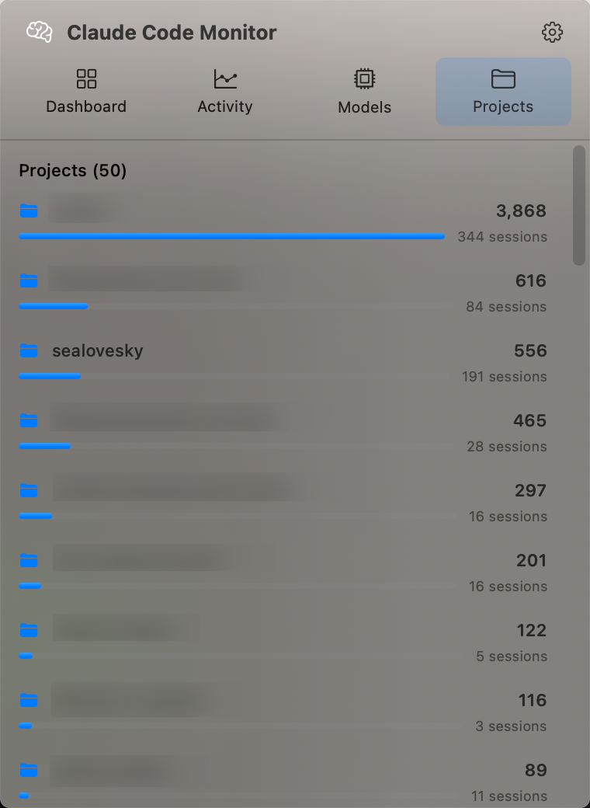

# ClaudeCodeMonitor

<p align="center">
  
</p>

<p align="center">
  A native macOS menu bar app for monitoring your Claude Code usage and activity stats.
</p>

<p align="center">
  <a href="https://developer.apple.com/swift/"></a>
  <a href="https://github.com/sealovesky/ClaudeCodeMonitor/releases"></a>
  <a href="LICENSE"></a>
  <a href="https://github.com/sealovesky/ClaudeCodeMonitor/stargazers"></a>
</p>

<p align="center">
  
  
  
</p>

[English](#english) | [中文](#中文)

---

## English

### Introduction

ClaudeCodeMonitor is a lightweight macOS menu bar application that provides real-time monitoring of your [Claude Code](https://docs.anthropic.com/en/docs/claude-code) usage. It reads local data from `~/.claude/` to display activity stats, token consumption, model distribution, project rankings, and API quota — all without any network overhead.

### Features

#### Dashboard
- Today's message count, session count, tool calls, and active sessions
- 7-day activity trend bar chart
- Lifetime statistics summary

#### Activity
- 30-day message trend line chart
- 24-hour usage heatmap (see your most productive hours)

#### Models
- Donut chart showing output token distribution across models (Opus, Sonnet, etc.)
- Detailed token breakdown per model (Input / Output / Cache)

#### Projects
- Project ranking by message count (parsed from `history.jsonl`)
- Session count and last active time per project

#### Usage Quota
- Real-time API quota display (5-hour session / 7-day all models / 7-day Sonnet)
- Progress bars with color indicators
- Auto-refresh via Anthropic OAuth API

#### Settings
- Launch at login (SMAppService)
- Customizable usage level thresholds

### Screenshots

<p align="center">
  
</p>

<p align="center">
  
</p>

<p align="center">
  
</p>

<p align="center">
  
</p>

### Installation

#### Requirements
- macOS 14.0 (Sonoma) or later
- [Claude Code](https://docs.anthropic.com/en/docs/claude-code) installed and used at least once
- Xcode 16.0 or later (for building from source)

#### From Source

```bash
# Clone the repository
git clone https://github.com/sealovesky/ClaudeCodeMonitor.git
cd ClaudeCodeMonitor

# Build and run
swift run
```

#### Download Release

Check the [Releases](https://github.com/sealovesky/ClaudeCodeMonitor/releases) page for pre-built binaries.

### Usage

1. **Launch** — ClaudeCodeMonitor appears as a brain icon in your menu bar
2. **Click** — Click the icon to open the monitoring popover
3. **Browse** — Switch between Dashboard / Activity / Models / Projects tabs
4. **Color indicator** — The icon changes color based on today's usage:
   - Green: < 500 messages
   - Yellow: 500–2000 messages
   - Red: > 2000 messages

### How It Works

ClaudeCodeMonitor reads data from your local `~/.claude/` directory:

| File | Data | Purpose |
|------|------|---------|
| `stats-cache.json` | Daily activity, model tokens, hourly distribution | Dashboard, Activity, Models |
| `history.jsonl` | Prompt history with project and session info | Projects ranking |
| `session-env/` | Active session directories | Active session count |

For API quota display, it reads your OAuth token from Keychain (set by Claude Code) and queries the Anthropic usage API.

**No data is collected or sent anywhere.** Everything stays local.

### Project Structure

```
ClaudeCodeMonitor/
├── Package.swift                    # Swift Package configuration
├── Sources/ClaudeCodeMonitor/
│   ├── App/
│   │   └── ClaudeCodeMonitorApp.swift   # @main entry, MenuBarExtra
│   ├── Models/
│   │   ├── StatsCache.swift             # stats-cache.json Codable model
│   │   ├── HistoryEntry.swift           # history.jsonl line model
│   │   └── ProjectStats.swift           # Aggregated project statistics
│   ├── Services/
│   │   ├── FileMonitor.swift            # DispatchSource file watcher
│   │   ├── StatsParser.swift            # JSON parser for stats-cache
│   │   ├── HistoryParser.swift          # JSONL parser for history
│   │   └── UsageAPI.swift               # Anthropic OAuth usage API
│   ├── ViewModels/
│   │   └── MonitorStore.swift           # @Observable global state
│   ├── Views/
│   │   ├── MenuBarView.swift            # Popover root with tab navigation
│   │   ├── DashboardView.swift          # Today stats + 7-day chart
│   │   ├── ActivityView.swift           # 30-day chart + hour heatmap
│   │   ├── ModelsView.swift             # Donut chart + token breakdown
│   │   ├── ProjectsView.swift           # Project ranking list
│   │   ├── UsageSection.swift           # API quota progress bars
│   │   └── SettingsView.swift           # Settings window
│   └── Utilities/
│       ├── Constants.swift              # Paths, sizes, color thresholds
│       ├── TokenFormatter.swift         # Token number formatting (K/M/B)
│       └── LaunchAtLogin.swift          # SMAppService wrapper
```

### Tech Stack

- **UI Framework**: SwiftUI + MenuBarExtra (`.window` style)
- **Charts**: Swift Charts (BarMark, LineMark, SectorMark)
- **File Monitoring**: DispatchSource (GCD)
- **State Management**: @Observable (Observation framework)
- **Auth**: Keychain Services (read Claude Code OAuth token)
- **Launch at Login**: SMAppService

### Roadmap

- [x] Dashboard with today's stats and weekly trend
- [x] 30-day activity chart
- [x] 24-hour usage heatmap
- [x] Model usage donut chart and token breakdown
- [x] Project ranking from history
- [x] Real-time API quota display
- [x] Launch at login
- [x] Customizable usage thresholds
- [ ] Notification when approaching rate limit
- [ ] Export usage report (CSV/JSON)
- [ ] Historical quota tracking
- [ ] Dark/Light theme customization
- [ ] Sparkline in menu bar icon
- [ ] Localization (English & Chinese)

### License

MIT License — see [LICENSE](LICENSE) for details.

---

## 中文

### 简介

ClaudeCodeMonitor 是一款轻量级的 macOS 菜单栏应用，用于实时监控 [Claude Code](https://docs.anthropic.com/en/docs/claude-code) 的使用情况。它读取 `~/.claude/` 目录下的本地数据，展示活动统计、Token 消耗、模型分布、项目排行和 API 配额，无需额外网络开销。

### 功能特性

#### 仪表板
- 今日消息数、会话数、工具调用次数、活跃会话数
- 7 天活动趋势柱状图
- 累计使用统计

#### 活动
- 30 天消息量折线图
- 24 小时使用热力图（发现你最高效的时段）

#### 模型
- 甜甜圈图展示各模型 Output Token 占比（Opus、Sonnet 等）
- 各模型 Token 细分（Input / Output / Cache）

#### 项目
- 按消息数排名的项目列表（解析自 `history.jsonl`）
- 每个项目的会话数和最后活跃时间

#### 用量配额
- 实时 API 配额展示（5小时会话 / 7天全模型 / 7天 Sonnet）
- 带颜色指示的进度条
- 通过 Anthropic OAuth API 自动刷新

#### 设置
- 开机自启动（SMAppService）
- 自定义用量等级阈值

### 截图

<p align="center">
  
</p>

<p align="center">
  
</p>

<p align="center">
  
</p>

### 安装

#### 环境要求
- macOS 14.0 (Sonoma) 或更高版本
- 已安装并使用过 [Claude Code](https://docs.anthropic.com/en/docs/claude-code)
- Xcode 16.0 或更高版本（从源码构建）

#### 从源码构建

```bash
# 克隆仓库
git clone https://github.com/sealovesky/ClaudeCodeMonitor.git
cd ClaudeCodeMonitor

# 构建运行
swift run
```

#### 下载发布版

前往 [Releases](https://github.com/sealovesky/ClaudeCodeMonitor/releases) 页面下载预编译版本。

### 使用方法

1. **启动** — ClaudeCodeMonitor 会在菜单栏显示一个大脑图标
2. **点击** — 点击图标打开监控面板
3. **浏览** — 在 Dashboard / Activity / Models / Projects 标签页之间切换
4. **颜色指示** — 图标颜色根据今日用量变化：
   - 绿色：< 500 条消息
   - 黄色：500–2000 条消息
   - 红色：> 2000 条消息

### 工作原理

ClaudeCodeMonitor 读取本地 `~/.claude/` 目录下的数据：

| 文件 | 数据 | 用途 |
|------|------|------|
| `stats-cache.json` | 每日活动、模型 Token、小时分布 | 仪表板、活动、模型 |
| `history.jsonl` | 提示词历史（项目、会话信息） | 项目排行 |
| `session-env/` | 活跃会话目录 | 活跃会话计数 |

API 配额显示通过读取 Keychain 中的 OAuth Token（由 Claude Code 设置）查询 Anthropic 用量 API。

**不收集或发送任何数据。** 一切都在本地完成。

### 项目结构

```
ClaudeCodeMonitor/
├── Package.swift                    # Swift Package 配置
├── Sources/ClaudeCodeMonitor/
│   ├── App/
│   │   └── ClaudeCodeMonitorApp.swift   # @main 入口, MenuBarExtra
│   ├── Models/
│   │   ├── StatsCache.swift             # stats-cache.json 数据模型
│   │   ├── HistoryEntry.swift           # history.jsonl 行模型
│   │   └── ProjectStats.swift           # 项目聚合统计
│   ├── Services/
│   │   ├── FileMonitor.swift            # DispatchSource 文件监控
│   │   ├── StatsParser.swift            # stats-cache JSON 解析器
│   │   ├── HistoryParser.swift          # history JSONL 解析器
│   │   └── UsageAPI.swift               # Anthropic OAuth 用量 API
│   ├── ViewModels/
│   │   └── MonitorStore.swift           # @Observable 全局状态管理
│   ├── Views/
│   │   ├── MenuBarView.swift            # Popover 根视图 + Tab 导航
│   │   ├── DashboardView.swift          # 今日统计 + 7天柱状图
│   │   ├── ActivityView.swift           # 30天折线图 + 小时热力图
│   │   ├── ModelsView.swift             # 甜甜圈图 + Token 分布
│   │   ├── ProjectsView.swift           # 项目排行列表
│   │   ├── UsageSection.swift           # API 配额进度条
│   │   └── SettingsView.swift           # 设置窗口
│   └── Utilities/
│       ├── Constants.swift              # 路径、尺寸、颜色阈值
│       ├── TokenFormatter.swift         # Token 数字格式化 (K/M/B)
│       └── LaunchAtLogin.swift          # SMAppService 封装
```

### 技术栈

- **UI 框架**: SwiftUI + MenuBarExtra (`.window` 风格)
- **图表**: Swift Charts (BarMark, LineMark, SectorMark)
- **文件监控**: DispatchSource (GCD)
- **状态管理**: @Observable (Observation 框架)
- **认证**: Keychain Services（读取 Claude Code OAuth Token）
- **开机启动**: SMAppService

### 开发计划

- [x] 今日统计仪表板和周趋势
- [x] 30 天活动图表
- [x] 24 小时使用热力图
- [x] 模型使用甜甜圈图和 Token 分布
- [x] 历史项目排行
- [x] 实时 API 配额展示
- [x] 开机自启动
- [x] 自定义用量阈值
- [ ] 接近限额时推送通知
- [ ] 导出使用报告 (CSV/JSON)
- [ ] 历史配额追踪
- [ ] 深色/浅色主题自定义
- [ ] 菜单栏图标迷你曲线
- [ ] 多语言支持（中英文）

### 许可证

MIT License — 详见 [LICENSE](LICENSE)

---

## Contributing

Contributions are welcome! Please feel free to submit a Pull Request.

1. Fork the repository
2. Create your feature branch (`git checkout -b feature/AmazingFeature`)
3. Commit your changes (`git commit -m 'Add some AmazingFeature'`)
4. Push to the branch (`git push origin feature/AmazingFeature`)
5. Open a Pull Request

## Acknowledgments

- Built for [Claude Code](https://docs.anthropic.com/en/docs/claude-code) by Anthropic
- Powered by SwiftUI and Swift Charts
- Inspired by the `/status` command in Claude Code CLI
