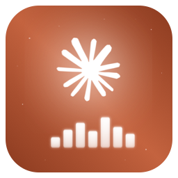
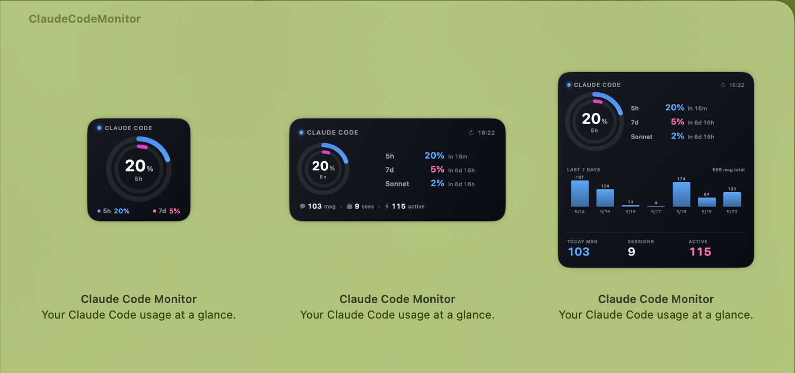
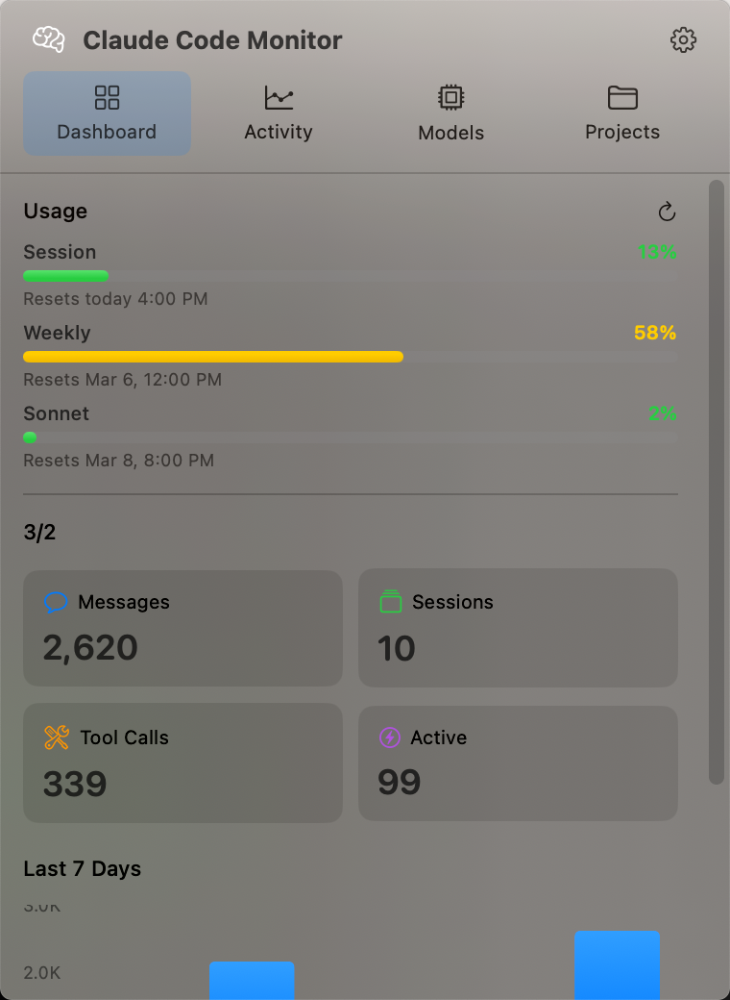
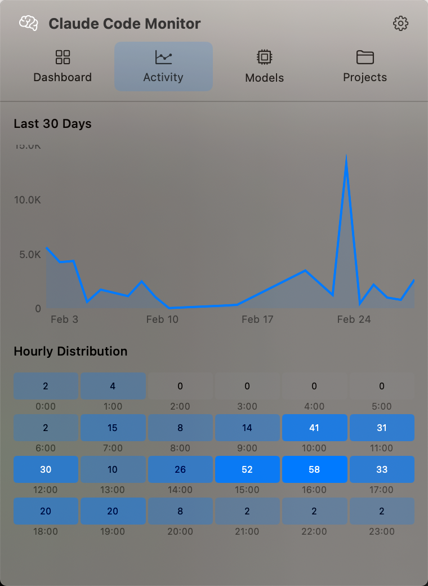
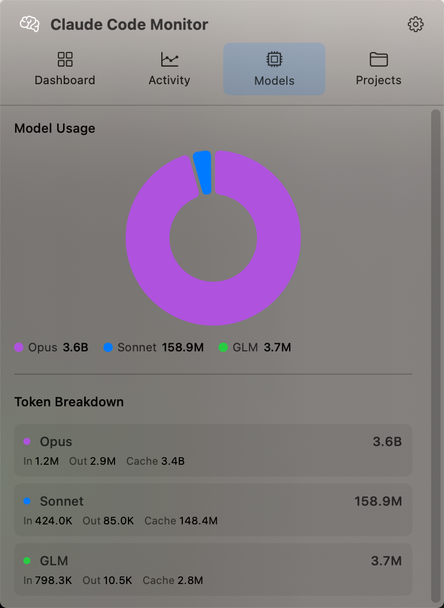
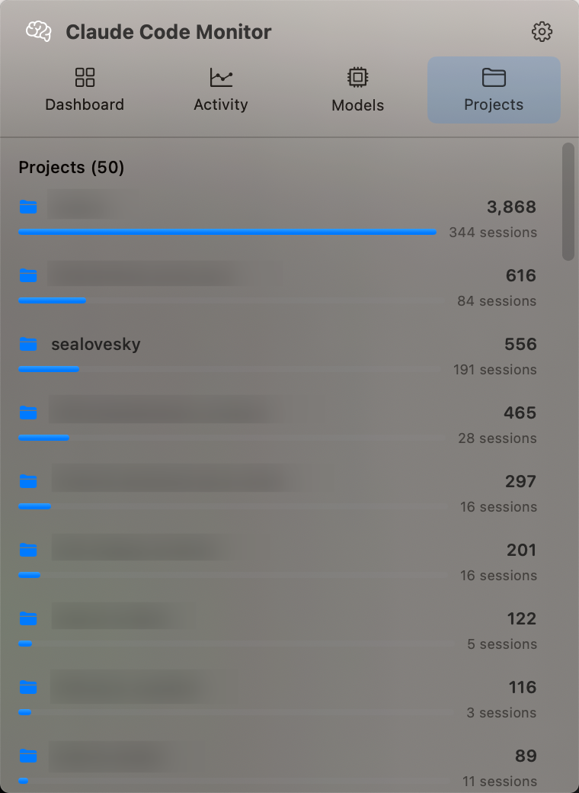

# ClaudeCodeMonitor

<p align="center">
  
</p>

<p align="center">
  A native macOS menu bar + desktop widget app for monitoring your Claude Code usage and activity stats.
</p>

<p align="center">
  <a href="https://developer.apple.com/swift/"></a>
  <a href="https://github.com/sealovesky/ClaudeCodeMonitor/releases"></a>
  <a href="LICENSE"></a>
  <a href="https://github.com/sealovesky/ClaudeCodeMonitor/stargazers"></a>
</p>

<p align="center">
  
  
  
</p>

[English](#english) | [中文](#中文)

---

## English

### Introduction

ClaudeCodeMonitor is a lightweight macOS menu bar application — with a matching desktop widget — that provides real-time monitoring of your [Claude Code](https://docs.anthropic.com/en/docs/claude-code) usage. It reads local data from `~/.claude/` to display activity stats, token consumption, model distribution, project rankings, and API quota — all without any network overhead beyond the OAuth usage API.

### Features

#### Desktop Widget (new in v1.3.0)
- Apple Activity Ring style dual ring: outer 5h quota (threshold-tinted blue/orange/red), inner 7d quota (fixed pink)
- Three sizes (Small / Medium / Large) with progressively richer info
- Data delivered to widget via local HTTP loopback (App → `127.0.0.1:53128` → Widget); no network calls from the widget extension itself

#### Dashboard
- Today's message count, session count, tool calls, and active sessions
- 7-day activity trend bar chart
- Lifetime statistics summary

#### Activity
- 30-day message trend line chart
- 24-hour usage heatmap (see your most productive hours)

#### Models
- Donut chart showing output token distribution across models (Opus, Sonnet, etc.)
- Detailed token breakdown per model (Input / Output / Cache)

#### Projects
- Project ranking by message count (parsed from `history.jsonl`)
- Session count and last active time per project

#### Usage Quota
- Real-time API quota display (5-hour session / 7-day all models / 7-day Sonnet)
- Progress bars with color indicators
- Auto-refresh via Anthropic OAuth API

#### Settings
- Launch at login (SMAppService)
- Customizable usage level thresholds

### Screenshots

<p align="center">
  
  <br/>
  <em>Desktop widget — three sizes</em>
</p>

<p align="center">
  
</p>

<p align="center">
  
</p>

<p align="center">
  
</p>

<p align="center">
  
</p>

### Installation

#### Requirements
- macOS 14.0 (Sonoma) or later
- [Claude Code](https://docs.anthropic.com/en/docs/claude-code) installed and used at least once
- Xcode 16.0 or later (for building from source)
- [XcodeGen](https://github.com/yonaskolb/XcodeGen) (`brew install xcodegen`)
- An Apple Developer account (Personal Team is fine, free) — required because the Widget Extension must be signed with a cert that has a real `TeamIdentifier`. Self-signed certs are silently rejected by `chronod`.

#### From Source

```bash
# Clone
git clone https://github.com/sealovesky/ClaudeCodeMonitor.git
cd ClaudeCodeMonitor

# Set up your local signing config (one-time)
cp project.local.example.yml project.local.yml
# Edit project.local.yml — fill in your Apple Dev cert CN and Team ID.
# See comments in that file for how to find them via `security find-identity`.

# One-shot build (regenerates xcodeproj, builds Release, copies to build/)
./build.sh
open build/ClaudeCodeMonitor.app
```

If you'd rather work in Xcode:

```bash
xcodegen generate
open ClaudeCodeMonitor.xcodeproj
```

> **Note:** `project.local.yml` is gitignored — your cert info stays on your machine.

#### Download Release

Check the [Releases](https://github.com/sealovesky/ClaudeCodeMonitor/releases) page for pre-built binaries.

### Usage

1. **Launch** — ClaudeCodeMonitor appears as a brain icon in your menu bar
2. **Click** — Click the icon to open the monitoring popover
3. **Browse** — Switch between Dashboard / Activity / Models / Projects tabs
4. **Color indicator** — The icon changes color based on today's usage:
   - Green: < 500 messages
   - Yellow: 500–2000 messages
   - Red: > 2000 messages

### How It Works

ClaudeCodeMonitor reads data from your local `~/.claude/` directory:

| File / Dir | Data | Purpose |
|------|------|---------|
| `projects/<project>/*.jsonl` | Session message streams (parsed by `SessionParser`) | Today stats, 7d / 30d trends, model breakdown, hourly heatmap |
| `history.jsonl` | Prompt history with project and session info | Projects ranking |
| `session-env/` | Active session directories | Active session count |

For API quota display, the app reads your OAuth token from `~/.claude/.credentials.json` (or Keychain via the `security` CLI as fallback) and queries the Anthropic usage API every 30 minutes.

**Widget data flow:** App ↔ Widget extension talk via local HTTP loopback (`127.0.0.1:53128`), not App Group files. This avoids the TCC `SystemPolicyAppData` restriction that silently blocks widgets from reading other-process output on macOS Sonoma+. The widget extension itself makes zero external network calls — it only fetches from the in-app server.

**No data is collected or sent anywhere outside Anthropic's official OAuth endpoint.** Everything else stays local.

### Project Structure

```
ClaudeCodeMonitor/
├── project.yml                      # XcodeGen config (run `xcodegen generate`)
├── project.local.example.yml        # Local signing config template (copy to project.local.yml)
├── build.sh                         # One-shot xcodegen + xcodebuild + sign
├── ClaudeCodeMonitor.entitlements   # App entitlements (currently empty — App is not sandboxed)
├── Sources/
│   ├── ClaudeCodeMonitor/           # Main app target
│   │   ├── App/ClaudeCodeMonitorApp.swift     # @main entry, MenuBarExtra
│   │   ├── Models/                            # Codable types (StatsCache, HistoryEntry, ProjectStats)
│   │   ├── Services/
│   │   │   ├── SessionParser.swift            # JSONL parser for ~/.claude/projects/
│   │   │   ├── HistoryParser.swift            # JSONL parser for history.jsonl
│   │   │   ├── UsageAPI.swift                 # Anthropic OAuth usage API
│   │   │   └── SnapshotHTTPServer.swift       # 127.0.0.1:53128 server (NWListener)
│   │   ├── ViewModels/MonitorStore.swift      # @Observable global state + 30 min OAuth timer
│   │   ├── Views/                             # Dashboard / Activity / Models / Projects / Usage / Settings
│   │   └── Utilities/                         # Constants / TokenFormatter / LaunchAtLogin
│   ├── ClaudeCodeMonitorWidget/     # Widget Extension target (sandboxed)
│   │   ├── ClaudeCodeMonitorWidget.swift      # @main, three families, dual ring visual
│   │   ├── SnapshotLoader.swift               # URLSession sync GET to 127.0.0.1:53128
│   │   └── ClaudeCodeMonitorWidget.entitlements  # sandbox + network.client
│   └── Shared/                      # Code visible to both targets
│       └── WidgetSnapshot.swift               # Codable model + loopback constants
└── assets/AppIcon.icns
```

### Tech Stack

- **UI**: SwiftUI + MenuBarExtra (`.window` style) + WidgetKit
- **Charts**: Swift Charts (BarMark, LineMark, SectorMark)
- **App ↔ Widget IPC**: Local HTTP loopback via `Network.framework` (NWListener + URLSession)
- **State Management**: @Observable (Observation framework)
- **Auth**: OAuth token from `~/.claude/.credentials.json` or Keychain (via `security` CLI)
- **Launch at Login**: SMAppService

### Roadmap

- [x] Dashboard with today's stats and weekly trend
- [x] 30-day activity chart
- [x] 24-hour usage heatmap
- [x] Model usage donut chart and token breakdown
- [x] Project ranking from history
- [x] Real-time API quota display
- [x] Launch at login
- [x] Customizable usage thresholds
- [x] Desktop widget (Small / Medium / Large) **— v1.3.0**
- [ ] Notification when approaching rate limit
- [ ] Export usage report (CSV/JSON)
- [ ] Historical quota tracking
- [ ] Dark/Light theme customization
- [ ] Sparkline in menu bar icon
- [ ] Localization (English & Chinese)

### License

MIT License — see [LICENSE](LICENSE) for details.

---

## 中文

### 简介

ClaudeCodeMonitor 是一款轻量级的 macOS 菜单栏应用，配套桌面 widget，用于实时监控 [Claude Code](https://docs.anthropic.com/en/docs/claude-code) 的使用情况。它读取 `~/.claude/` 目录下的本地数据，展示活动统计、Token 消耗、模型分布、项目排行和 API 配额，除 OAuth 用量接口外无网络请求。

### 功能特性

#### 桌面 Widget（v1.3.0 新增）
- Apple Activity Ring 风格双环：外环 5h 配额（按阈值变蓝/橙/红），内环 7d 配额（固定粉色）
- 三种尺寸（Small / Medium / Large），信息密度递增
- App ↔ Widget 通过本地 HTTP loopback（`127.0.0.1:53128`）传数据，widget 自身不发任何外网请求

#### 仪表板
- 今日消息数、会话数、工具调用次数、活跃会话数
- 7 天活动趋势柱状图
- 累计使用统计

#### 活动
- 30 天消息量折线图
- 24 小时使用热力图（发现你最高效的时段）

#### 模型
- 甜甜圈图展示各模型 Output Token 占比（Opus、Sonnet 等）
- 各模型 Token 细分（Input / Output / Cache）

#### 项目
- 按消息数排名的项目列表（解析自 `history.jsonl`）
- 每个项目的会话数和最后活跃时间

#### 用量配额
- 实时 API 配额展示（5小时会话 / 7天全模型 / 7天 Sonnet）
- 带颜色指示的进度条
- 通过 Anthropic OAuth API 自动刷新

#### 设置
- 开机自启动（SMAppService）
- 自定义用量等级阈值

### 截图

<p align="center">
  
  <br/>
  <em>桌面 widget 三种尺寸</em>
</p>

<p align="center">
  
</p>

<p align="center">
  
</p>

<p align="center">
  
</p>

### 安装

#### 环境要求
- macOS 14.0 (Sonoma) 或更高版本
- 已安装并使用过 [Claude Code](https://docs.anthropic.com/en/docs/claude-code)
- Xcode 16.0 或更高版本（从源码构建）
- [XcodeGen](https://github.com/yonaskolb/XcodeGen)（`brew install xcodegen`）
- Apple Developer 账号（个人 Team 免费即可）—— Widget Extension 必须用带 `TeamIdentifier` 的证书签名，自签证书 `chronod` 会静默拒绝加载

#### 从源码构建

```bash
# 克隆
git clone https://github.com/sealovesky/ClaudeCodeMonitor.git
cd ClaudeCodeMonitor

# 配置本地签名（一次性）
cp project.local.example.yml project.local.yml
# 编辑 project.local.yml，填入自己的 Apple Dev 证书 CN 和 Team ID
# 文件里有注释告诉你怎么用 security find-identity 查

# 一键构建（regenerate xcodeproj + xcodebuild Release + 拷贝到 build/）
./build.sh
open build/ClaudeCodeMonitor.app
```

更喜欢用 Xcode：

```bash
xcodegen generate
open ClaudeCodeMonitor.xcodeproj
```

> **注意：** `project.local.yml` 已 gitignore，证书信息只留在你本地。

#### 下载发布版

前往 [Releases](https://github.com/sealovesky/ClaudeCodeMonitor/releases) 页面下载预编译版本。

### 使用方法

1. **启动** — ClaudeCodeMonitor 会在菜单栏显示一个大脑图标
2. **点击** — 点击图标打开监控面板
3. **浏览** — 在 Dashboard / Activity / Models / Projects 标签页之间切换
4. **颜色指示** — 图标颜色根据今日用量变化：
   - 绿色：< 500 条消息
   - 黄色：500–2000 条消息
   - 红色：> 2000 条消息

### 工作原理

ClaudeCodeMonitor 读取本地 `~/.claude/` 目录下的数据：

| 文件 / 目录 | 数据 | 用途 |
|------|------|------|
| `projects/<project>/*.jsonl` | 各项目 session 消息流（`SessionParser` 解析） | 今日统计、7/30 天趋势、模型分布、小时热力图 |
| `history.jsonl` | 提示词历史（项目、会话信息） | 项目排行 |
| `session-env/` | 活跃会话目录 | 活跃会话计数 |

API 配额显示通过读取 `~/.claude/.credentials.json`（或 Keychain via `security` CLI 兜底）的 OAuth Token，每 30 分钟查询一次 Anthropic 用量 API。

**Widget 数据流**：App ↔ Widget Extension 间通过本地 HTTP loopback（`127.0.0.1:53128`）传数据，不走 App Group 文件。规避 macOS Sonoma+ TCC `SystemPolicyAppData` 静默禁止 widget 读取其他进程产物的限制。Widget Extension 自身不发任何外网请求，只从 App 内嵌 server 拿数据。

**不向 Anthropic 官方 OAuth 接口以外的任何地方发送数据。** 其他一切都在本地完成。

### 项目结构

```
ClaudeCodeMonitor/
├── project.yml                      # XcodeGen 配置（改完跑 xcodegen generate）
├── project.local.example.yml        # 本地签名配置模板（拷为 project.local.yml）
├── build.sh                         # 一键 xcodegen + xcodebuild + 签名
├── ClaudeCodeMonitor.entitlements   # App entitlements（当前空 — App 不沙盒）
├── Sources/
│   ├── ClaudeCodeMonitor/           # 主 App target
│   │   ├── App/ClaudeCodeMonitorApp.swift     # @main 入口，MenuBarExtra
│   │   ├── Models/                            # Codable 类型 (StatsCache, HistoryEntry, ProjectStats)
│   │   ├── Services/
│   │   │   ├── SessionParser.swift            # ~/.claude/projects/ JSONL 解析器
│   │   │   ├── HistoryParser.swift            # history.jsonl 解析器
│   │   │   ├── UsageAPI.swift                 # Anthropic OAuth 用量 API
│   │   │   └── SnapshotHTTPServer.swift       # 127.0.0.1:53128 server (NWListener)
│   │   ├── ViewModels/MonitorStore.swift      # @Observable 全局状态 + 30 分钟 OAuth timer
│   │   ├── Views/                             # Dashboard / Activity / Models / Projects / Usage / Settings
│   │   └── Utilities/                         # Constants / TokenFormatter / LaunchAtLogin
│   ├── ClaudeCodeMonitorWidget/     # Widget Extension target（沙盒）
│   │   ├── ClaudeCodeMonitorWidget.swift      # @main, 三档 family, 双环视觉
│   │   ├── SnapshotLoader.swift               # 同步 URLSession GET 127.0.0.1:53128
│   │   └── ClaudeCodeMonitorWidget.entitlements  # sandbox + network.client
│   └── Shared/                      # 两个 target 共享代码
│       └── WidgetSnapshot.swift               # Codable 模型 + loopback 常量
└── assets/AppIcon.icns
```

### 技术栈

- **UI**: SwiftUI + MenuBarExtra (`.window` 风格) + WidgetKit
- **图表**: Swift Charts (BarMark, LineMark, SectorMark)
- **App ↔ Widget IPC**: 本地 HTTP loopback (Network.framework: NWListener + URLSession)
- **状态管理**: @Observable (Observation 框架)
- **认证**: OAuth Token 来自 `~/.claude/.credentials.json` 或 Keychain（via `security` CLI）
- **开机启动**: SMAppService

### 开发计划

- [x] 今日统计仪表板和周趋势
- [x] 30 天活动图表
- [x] 24 小时使用热力图
- [x] 模型使用甜甜圈图和 Token 分布
- [x] 历史项目排行
- [x] 实时 API 配额展示
- [x] 开机自启动
- [x] 自定义用量阈值
- [x] 桌面 widget（Small / Medium / Large）**— v1.3.0**
- [ ] 接近限额时推送通知
- [ ] 导出使用报告 (CSV/JSON)
- [ ] 历史配额追踪
- [ ] 深色/浅色主题自定义
- [ ] 菜单栏图标迷你曲线
- [ ] 多语言支持（中英文）

### 许可证

MIT License — 详见 [LICENSE](LICENSE)

---

## Contributing

Contributions are welcome! Please feel free to submit a Pull Request.

1. Fork the repository
2. Create your feature branch (`git checkout -b feature/AmazingFeature`)
3. Commit your changes (`git commit -m 'Add some AmazingFeature'`)
4. Push to the branch (`git push origin feature/AmazingFeature`)
5. Open a Pull Request

## Acknowledgments

- Built for [Claude Code](https://docs.anthropic.com/en/docs/claude-code) by Anthropic
- Powered by SwiftUI and Swift Charts
- Inspired by the `/status` command in Claude Code CLI
